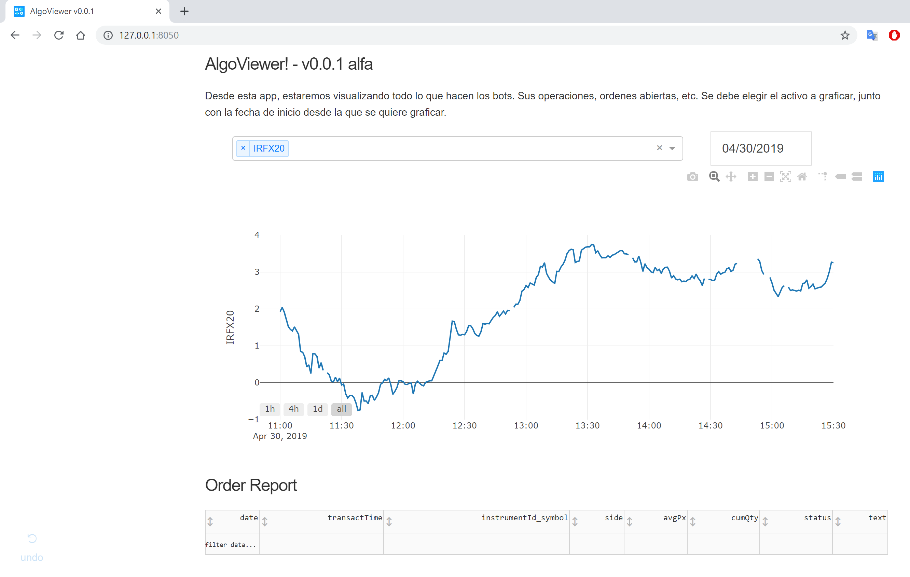

# AlgoViewer
Dash web app to watch the evolution in time of the assets, and a table with the order report of the running bots.
The app will be reading the database in the directory of the app, so, modifications had to be made to read a different Database (in the folder of the bot that is reading the market data).

